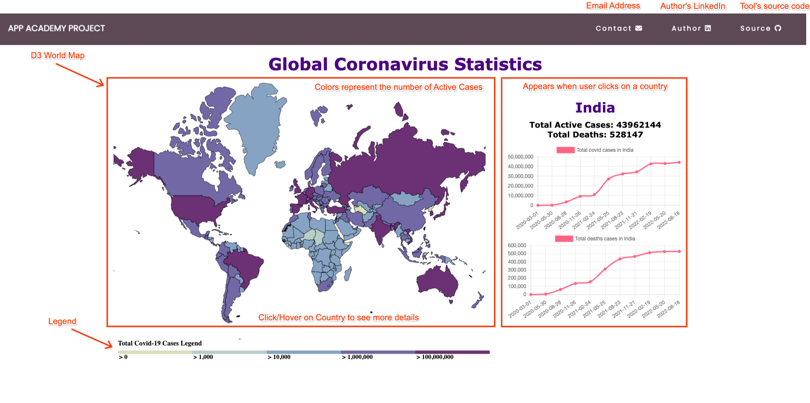

# Global Covid Statistics


A tool built to track global covid cases data and no. of deaths happened all over the world. 


# Table of Contents

1. Background
2. Functionality of Tool
3. Screenshots and Demonstration
4. Technologies, Libraries and API's

# Background

 This tracker provides the cumulative number of confirmed COVID-19 cases and deaths, as well as the cases and deaths by country increased over the years  and globally. The sole purpose of this project is to create nice-appealing user inerface that provide with the global covid data that include No. of active cases, no. of deaths happened over the courses of year. The goal for the project is to choose an API to fetch latest data around the globe. The tool will be designed to be responsivie, user-friendly connecting to provide data through the date it started until Nov-2022. 

 # Functionality of Tool

  In Global Covid Statistics, users will be able to:
 
 1. Access data about the total confirmed cases , No. of deaths from year 2020 to  Nov-2022. I used several API's to fetch data available via worldometer.
 2. A user can access data with a variety of events like :hover and :click.
 3. When a user hover over any country it gives nice visualiztion of active cases in a particular country. I have used API's to fetch data when a user hover on a particular country.
 4. In addtion to hover, this project include a click option as well. When a user click it fetch all the data and present it over the chart that gives no.  of confirmed and another chart that provide no. of deaths happend along with dates.

 # Screenshots Demonstration

 ## 1) Below is the detailed way to interact with my tool.
    

## 2)  Once the page is loaded, it fetch the data from local file for coloration of all the countries as per legend defined.

``` javascript
    const all_data = async (ele) => {
        try {
            let res = await fetch(`./src/scripts/coviddata.JSON`);
                return await res.json();
        } catch (err) {
                console.error(err);
        }
        };
```


# Technologies, Libraries, and API's


1) D3.js
2) Charts.js
3) Data.CDC.gov
4) Google Fonts API
5) Font Awesome API